# Pexels Extension - Implementation Plan

## Executive Summary

This document provides a comprehensive analysis of the Pexels Blender Extension codebase and outlines a detailed implementation plan for a robust caching system with background task architecture, progress tracking, and improved error handling.

---

## 1. Current State Analysis

### 1.1 Architecture Overview

The extension follows a modular architecture with clear separation of concerns:

```
┌─────────────────────────────────────────────────────────────────┐
│                        __init__.py                               │
│                   Registration & Lifecycle                       │
└─────────────────────────────────────────────────────────────────┘
                              │
        ┌─────────────────────┼─────────────────────┐
        ▼                     ▼                     ▼
┌───────────────┐    ┌───────────────┐    ┌───────────────┐
│  properties.py │    │  operators.py  │    │    ui.py      │
│  Data Models   │    │  Business Logic│    │  Presentation │
└───────────────┘    └───────────────┘    └───────────────┘
        │                     │                     │
        └─────────────────────┼─────────────────────┘
                              ▼
                    ┌───────────────┐
                    │   utils.py    │
                    │   Utilities   │
                    └───────────────┘
                              │
                              ▼
                    ┌───────────────┐
                    │    api.py     │
                    │  HTTP/Network │
                    └───────────────┘
```

### 1.2 File-by-File Analysis

#### [`__init__.py`](__init__.py) - Entry Point (62 lines)
- **Purpose**: Extension registration and lifecycle management
- **Key Functions**:
  - [`register()`](__init__.py:19) - Initializes preview manager, registers classes, adds scene property
  - [`unregister()`](__init__.py:38) - Cleanup with proper error handling
- **Patterns Used**: 
  - Try-catch for registration failures
  - Reverse order unregistration
  - Silent failure on unregister to avoid blocking Blender shutdown

#### [`api.py`](api.py) - Network Layer (109 lines)
- **Purpose**: Pexels API communication
- **Key Components**:
  - [`PexelsAPIError`](api.py:18) - Custom exception class
  - [`_http_get()`](api.py:23) - Low-level HTTP GET with timeout
  - [`_http_json()`](api.py:40) - JSON parsing wrapper
  - [`search_images()`](api.py:52) - Main search API
  - [`download_image()`](api.py:88) - Image download function
- **Current Error Handling**:
  - HTTP 401 → Invalid API key message
  - HTTP 429 → Rate limit exceeded
  - URLError → Network error
  - JSONDecodeError → Invalid response

#### [`operators.py`](operators.py) - Business Logic (654 lines)
- **Purpose**: Blender operators for user actions
- **Key Operators**:
  - [`PEXELS_OT_Search`](operators.py:13) - Search execution
  - [`PEXELS_OT_Page`](operators.py:162) - Pagination
  - [`PEXELS_OT_Import`](operators.py:192) - Image import
  - [`PEXELS_OT_ClearCache`](operators.py:260) - Cache clearing
  - [`PEXELS_OT_OpenPreferences`](operators.py:285) - Preferences access
  - [`PEXELS_OT_OverlayWidget`](operators.py:410) - Modal overlay preview
- **Widget System**:
  - [`PEXELS_UI_ImageWidget`](operators.py:299) - GPU-based image widget with drag/resize

#### [`properties.py`](properties.py) - Data Models (346 lines)
- **Purpose**: Blender property groups and preferences
- **Key Classes**:
  - [`PEXELS_Item`](properties.py:10) - Individual image data
  - [`PEXELS_State`](properties.py:91) - Main addon state
  - [`PEXELS_AddonPrefs`](properties.py:249) - User preferences
- **Key Function**:
  - [`pexels_enum_items()`](properties.py:44) - Dynamic enum callback for icon view

#### [`utils.py`](utils.py) - Utilities (289 lines)
- **Purpose**: File handling, image processing, preview management
- **Key Components**:
  - [`ensure_temp_directory()`](utils.py:15) - Temp directory creation
  - [`write_temp_file()`](utils.py:22) - File writing
  - [`load_image_from_url()`](utils.py:58) - URL to Blender image
  - [`create_plane_with_image()`](utils.py:115) - Plane creation with texture
  - [`PreviewManager`](utils.py:228) - Preview collection management
- **Global Instance**: [`preview_manager`](utils.py:289)

#### [`ui.py`](ui.py) - User Interface (273 lines)
- **Purpose**: Panel definitions and UI layout
- **Key Panels**:
  - [`PEXELS_PT_Panel`](ui.py:9) - Main panel with search, results, import
  - [`PEXELS_PT_Settings`](ui.py:215) - Settings sub-panel

### 1.3 Current Data Flow


### 1.4 Current Threading Model

**Current State: SYNCHRONOUS / BLOCKING**

All operations currently run on the main thread:
- Search API calls block the UI
- Thumbnail downloads are sequential and blocking
- Image imports block until complete
- No background processing

The only async-like behavior is the modal operator [`PEXELS_OT_OverlayWidget`](operators.py:410) which uses:
- Timer events for periodic updates
- Modal handler for continuous interaction
- GPU draw handler for rendering

---

## 2. Issues Found

### 2.1 Critical Issues

#### Issue #1: Blocking UI During Network Operations
- **Location**: [`operators.py:39-97`](operators.py:39) - `_perform_search()`
- **Problem**: All network calls block the main thread
- **Impact**: Blender UI freezes during search and thumbnail loading
- **Severity**: HIGH

#### Issue #2: No Network Connectivity Check
- **Location**: [`api.py:23-37`](api.py:23) - `_http_get()`
- **Problem**: No pre-flight connectivity check before API calls
- **Impact**: Poor UX when offline, no respect for Blender's "Online Access" preference
- **Severity**: HIGH

#### Issue #3: No Cancellation Support
- **Location**: Throughout [`operators.py`](operators.py)
- **Problem**: Long-running operations cannot be cancelled
- **Impact**: Users must wait for operations to complete or restart Blender
- **Severity**: HIGH

#### Issue #4: Sequential Thumbnail Downloads
- **Location**: [`operators.py:99-140`](operators.py:99) - `_process_search_results()`
- **Problem**: Thumbnails downloaded one-by-one synchronously
- **Impact**: Slow loading, especially with 50+ results
- **Severity**: MEDIUM-HIGH

### 2.2 Potential Null Reference Issues

#### Issue #5: Unchecked Context Access
- **Location**: [`properties.py:195`](properties.py:195)
```python
enum_items = pexels_enum_items(self, bpy.context)
```
- **Problem**: `bpy.context` can be None in certain Blender states
- **Severity**: MEDIUM

#### Issue #6: Missing Null Check for Preferences
- **Location**: [`operators.py:25`](operators.py:25)
```python
prefs = context.preferences.addons[__package__].preferences
```
- **Problem**: No check if addon is registered in preferences
- **Severity**: LOW (unlikely but possible during registration)

#### Issue #7: Unchecked Image Size Access
- **Location**: [`operators.py:367-371`](operators.py:367)
```python
if self.image and self.image.size[0] and self.image.size[1]:
    iw = float(self.image.size[0])
    ih = float(self.image.size[1])
```
- **Problem**: `image.size` could be `[0, 0]` for unloaded images
- **Severity**: LOW (handled with check but could be cleaner)

### 2.3 Race Condition Risks

#### Issue #8: Preview Manager State
- **Location**: [`utils.py:228-289`](utils.py:228) - `PreviewManager`
- **Problem**: No thread safety for `_previews` dictionary access
- **Impact**: Potential corruption if accessed from multiple threads
- **Severity**: HIGH (when implementing threading)

#### Issue #9: State Modification During Iteration
- **Location**: [`properties.py:154-161`](properties.py:154) - `clear_results()`
```python
def clear_results(self):
    self.items.clear()
    self.total_results = 0
    self._selected_icon = None
    preview_manager.clear_previews()
```
- **Problem**: If called while enum items are being generated, could cause issues
- **Severity**: MEDIUM

#### Issue #10: Enum Callback Race
- **Location**: [`properties.py:44-88`](properties.py:44) - `pexels_enum_items()`
- **Problem**: Enum callback accesses `self.items` which could be modified during iteration
- **Severity**: MEDIUM

### 2.4 Memory Leak Risks

#### Issue #11: Temp Files Not Cleaned Up
- **Location**: [`utils.py:22-36`](utils.py:22) - `write_temp_file()`
- **Problem**: Temporary files accumulate in temp directory
- **Impact**: Disk space consumption over time
- **Severity**: MEDIUM

#### Issue #12: Preview Collection Lifecycle
- **Location**: [`utils.py:239-243`](utils.py:239) - `clear_previews()`
- **Problem**: Previews only cleared on explicit call or unregister
- **Impact**: Memory accumulation during long sessions
- **Severity**: LOW-MEDIUM

#### Issue #13: Blender Images Not Removed
- **Location**: [`utils.py:58-74`](utils.py:58) - `load_image_from_url()`
- **Problem**: Images loaded into `bpy.data.images` are never removed
- **Impact**: Memory and .blend file bloat
- **Severity**: LOW

### 2.5 Exception Handling Issues

#### Issue #14: Bare Except Clauses
- **Location**: Multiple locations
  - [`operators.py:79`](operators.py:79): `except:`
  - [`operators.py:138`](operators.py:138): `except Exception:`
  - [`properties.py:83`](properties.py:83): `except Exception as e:`
  - [`properties.py:203`](properties.py:203): `except:`
- **Problem**: Overly broad exception handling hides specific errors
- **Severity**: MEDIUM

#### Issue #15: Silent Failures
- **Location**: [`operators.py:132-140`](operators.py:132) - `_load_thumbnail_preview()`
```python
except Exception:
    # Ignore thumbnail loading failures
    pass
```
- **Problem**: No logging of thumbnail failures
- **Severity**: LOW-MEDIUM

#### Issue #16: Missing Timeout Handling
- **Location**: [`api.py:27`](api.py:27)
```python
with urllib.request.urlopen(req, timeout=30) as resp:
```
- **Problem**: 30-second timeout is hardcoded, no retry on timeout
- **Severity**: MEDIUM

### 2.6 Edge Cases

#### Issue #17: Empty Search Results Handling
- **Location**: [`operators.py:102`](operators.py:102)
```python
photos = results.get("photos", []) or []
```
- **Problem**: Double fallback suggests uncertainty about API response
- **Severity**: LOW

#### Issue #18: Invalid Image Dimensions
- **Location**: [`utils.py:168-171`](utils.py:168)
```python
width = image.size[0] or 1
height = image.size[1] or 1
aspect_ratio = width / height
```
- **Problem**: Division by potentially small numbers
- **Severity**: LOW

#### Issue #19: Rate Limit Reset Handling
- **Location**: [`operators.py:142-159`](operators.py:142) - `_update_rate_limits()`
- **Problem**: Rate limit reset timestamp stored but never used
- **Severity**: LOW

### 2.7 Resource Disposal Issues

#### Issue #20: GPU Resources in Widget
- **Location**: [`operators.py:299-408`](operators.py:299) - `PEXELS_UI_ImageWidget`
- **Problem**: GPU batches and shaders recreated frequently without explicit cleanup
- **Severity**: LOW (GPU handles this, but not optimal)

#### Issue #21: Timer Not Always Removed
- **Location**: [`operators.py:626-644`](operators.py:626) - `cancel()`
- **Problem**: If modal exits abnormally, timer might not be removed
- **Severity**: LOW

---

## 3. Architecture Design

### 3.1 Proposed Architecture Overview

```mermaid
graph TB
    subgraph UI Layer
        Panel[PEXELS_PT_Panel]
        Progress[Progress Indicator]
    end
    
    subgraph Operator Layer
        SearchOp[PEXELS_OT_Search]
        ImportOp[PEXELS_OT_Import]
        CancelOp[PEXELS_OT_Cancel]
    end
    
    subgraph Task Management
        TaskManager[TaskManager]
        TaskQueue[Task Queue]
        WorkerThread[Worker Thread]
    end
    
    subgraph Cache System
        CacheManager[CacheManager]
        DiskCache[Disk Cache]
        MemoryCache[Memory Cache]
    end
    
    subgraph Network Layer
        NetworkManager[NetworkManager]
        ConnCheck[Connectivity Check]
        RetryLogic[Retry with Backoff]
        API[Pexels API]
    end
    
    Panel --> SearchOp
    Panel --> ImportOp
    Panel --> Progress
    
    SearchOp --> TaskManager
    ImportOp --> TaskManager
    CancelOp --> TaskManager
    
    TaskManager --> TaskQueue
    TaskQueue --> WorkerThread
    WorkerThread --> NetworkManager
    WorkerThread --> CacheManager
    
    NetworkManager --> ConnCheck
    NetworkManager --> RetryLogic
    RetryLogic --> API
    
    CacheManager --> DiskCache
    CacheManager --> MemoryCache
    
    TaskManager -.->|Progress Updates| Progress
```



### 3.2 New Module Structure

```
pexels_ext/
├── __init__.py              # Entry point (modified)
├── api.py                   # Network layer (modified)
├── operators.py             # Operators (modified)
├── properties.py            # Properties (modified)
├── ui.py                    # UI panels (modified)
├── utils.py                 # Utilities (modified)
├── cache_manager.py         # NEW: Caching system
├── task_manager.py          # NEW: Background task system
├── network_manager.py       # NEW: Network utilities
├── progress_tracker.py      # NEW: Progress tracking
└── blender_manifest.toml    # Manifest (unchanged)
```

### 3.3 Core Components Design

#### 3.3.1 TaskManager - Background Task System

```python
# task_manager.py

import threading
import queue
from dataclasses import dataclass, field
from enum import Enum, auto
from typing import Callable, Optional, Any
import time

class TaskStatus(Enum):
    PENDING = auto()
    RUNNING = auto()
    COMPLETED = auto()
    FAILED = auto()
    CANCELLED = auto()

class TaskPriority(Enum):
    LOW = 0
    NORMAL = 1
    HIGH = 2

@dataclass
class Task:
    id: str
    func: Callable
    args: tuple = field(default_factory=tuple)
    kwargs: dict = field(default_factory=dict)
    priority: TaskPriority = TaskPriority.NORMAL
    status: TaskStatus = TaskStatus.PENDING
    progress: float = 0.0
    message: str = ""
    result: Any = None
    error: Optional[Exception] = None
    on_progress: Optional[Callable] = None
    on_complete: Optional[Callable] = None
    on_error: Optional[Callable] = None
    cancellation_token: Optional[threading.Event] = None
    created_at: float = field(default_factory=time.time)
    started_at: Optional[float] = None
    completed_at: Optional[float] = None

class TaskManager:
    _instance = None
    _lock = threading.Lock()
    
    def __new__(cls):
        if cls._instance is None:
            with cls._lock:
                if cls._instance is None:
                    cls._instance = super().__new__(cls)
                    cls._instance._initialized = False
        return cls._instance
    
    def __init__(self):
        if self._initialized:
            return
        self._initialized = True
        self._task_queue = queue.PriorityQueue()
        self._active_tasks = {}
        self._worker_thread = None
        self._shutdown_event = threading.Event()
        self._tasks_lock = threading.Lock()
    
    def submit_task(self, task: Task) -> str:
        """Submit a task for background execution"""
        task.cancellation_token = threading.Event()
        with self._tasks_lock:
            self._active_tasks[task.id] = task
        self._task_queue.put((-task.priority.value, task.created_at, task))
        self._ensure_worker_running()
        return task.id
    
    def cancel_task(self, task_id: str) -> bool:
        """Request cancellation of a task"""
        with self._tasks_lock:
            if task_id in self._active_tasks:
                task = self._active_tasks[task_id]
                if task.cancellation_token:
                    task.cancellation_token.set()
                task.status = TaskStatus.CANCELLED
                return True
        return False
    
    def cancel_all_tasks(self):
        """Cancel all pending and running tasks"""
        with self._tasks_lock:
            for task in self._active_tasks.values():
                if task.cancellation_token:
                    task.cancellation_token.set()
                task.status = TaskStatus.CANCELLED
    
    def get_task_status(self, task_id: str) -> Optional[Task]:
        """Get current status of a task"""
        with self._tasks_lock:
            return self._active_tasks.get(task_id)
    
    def _ensure_worker_running(self):
        """Ensure worker thread is running"""
        if self._worker_thread is None or not self._worker_thread.is_alive():
            self._shutdown_event.clear()
            self._worker_thread = threading.Thread(
                target=self._worker_loop,
                daemon=True
            )
            self._worker_thread.start()
    
    def _worker_loop(self):
        """Main worker thread loop"""
        while not self._shutdown_event.is_set():
            try:
                _, _, task = self._task_queue.get(timeout=0.1)
                if task.status == TaskStatus.CANCELLED:
                    continue
                self._execute_task(task)
            except queue.Empty:
                continue
            except Exception as e:
                print(f"Worker error: {e}")
    
    def _execute_task(self, task: Task):
        """Execute a single task"""
        task.status = TaskStatus.RUNNING
        task.started_at = time.time()
        
        try:
            # Check for cancellation before starting
            if task.cancellation_token and task.cancellation_token.is_set():
                task.status = TaskStatus.CANCELLED
                return
            
            # Execute the task function
            task.result = task.func(
                *task.args,
                cancellation_token=task.cancellation_token,
                progress_callback=lambda p, m: self._update_progress(task, p, m),
                **task.kwargs
            )
            
            task.status = TaskStatus.COMPLETED
            task.completed_at = time.time()
            
            if task.on_complete:
                self._schedule_callback(task.on_complete, task)
                
        except Exception as e:
            task.status = TaskStatus.FAILED
            task.error = e
            task.completed_at = time.time()
            
            if task.on_error:
                self._schedule_callback(task.on_error, task, e)
    
    def _update_progress(self, task: Task, progress: float, message: str):
        """Update task progress"""
        task.progress = progress
        task.message = message
        if task.on_progress:
            self._schedule_callback(task.on_progress, task)
    
    def _schedule_callback(self, callback: Callable, *args):
        """Schedule callback to run on main thread via timer"""
        import bpy
        def run_callback():
            try:
                callback(*args)
            except Exception as e:
                print(f"Callback error: {e}")
            return None  # Don't repeat
        bpy.app.timers.register(run_callback, first_interval=0.0)
    
    def shutdown(self):
        """Shutdown the task manager"""
        self._shutdown_event.set()
        self.cancel_all_tasks()
        if self._worker_thread:
            self._worker_thread.join(timeout=2.0)

# Global instance
task_manager = TaskManager()
```

#### 3.3.2 CacheManager - Disk and Memory Caching

```python
# cache_manager.py

import os
import json
import hashlib
import time
import threading
from pathlib import Path
from dataclasses import dataclass
from typing import Optional, Dict, Any
import tempfile

@dataclass
class CacheEntry:
    key: str
    file_path: str
    size_bytes: int
    created_at: float
    last_accessed: float
    metadata: Dict[str, Any]

class CacheManager:
    """Thread-safe cache manager with disk and memory caching"""
    
    _instance = None
    _lock = threading.Lock()
    
    # Cache configuration
    MAX_CACHE_SIZE_MB = 500  # Maximum disk cache size
    MAX_MEMORY_ITEMS = 100   # Maximum items in memory cache
    CACHE_EXPIRY_DAYS = 7    # Cache expiry in days
    
    def __new__(cls):
        if cls._instance is None:
            with cls._lock:
                if cls._instance is None:
                    cls._instance = super().__new__(cls)
                    cls._instance._initialized = False
        return cls._instance
    
    def __init__(self):
        if self._initialized:
            return
        self._initialized = True
        
        self._cache_dir = self._get_cache_directory()
        self._index_file = os.path.join(self._cache_dir, "cache_index.json")
        self._index: Dict[str, CacheEntry] = {}
        self._memory_cache: Dict[str, bytes] = {}
        self._index_lock = threading.RLock()
        self._memory_lock = threading.RLock()
        
        self._load_index()
    
    def _get_cache_directory(self) -> str:
        """Get or create cache directory"""
        # Use Blender's user scripts directory for persistent cache
        import bpy
        user_path = bpy.utils.resource_path('USER')
        cache_dir = os.path.join(user_path, "cache", "pexels_ext")
        os.makedirs(cache_dir, exist_ok=True)
        return cache_dir
    
    def _load_index(self):
        """Load cache index from disk"""
        with self._index_lock:
            if os.path.exists(self._index_file):
                try:
                    with open(self._index_file, 'r') as f:
                        data = json.load(f)
                        for key, entry_data in data.items():
                            self._index[key] = CacheEntry(**entry_data)
                except Exception as e:
                    print(f"Failed to load cache index: {e}")
                    self._index = {}
    
    def _save_index(self):
        """Save cache index to disk"""
        with self._index_lock:
            try:
                data = {
                    key: {
                        'key': entry.key,
                        'file_path': entry.file_path,
                        'size_bytes': entry.size_bytes,
                        'created_at': entry.created_at,
                        'last_accessed': entry.last_accessed,
                        'metadata': entry.metadata
                    }
                    for key, entry in self._index.items()
                }
                with open(self._index_file, 'w') as f:
                    json.dump(data, f)
            except Exception as e:
                print(f"Failed to save cache index: {e}")
    
    def _generate_key(self, url: str, variant: str = "") -> str:
        """Generate cache key from URL"""
        content = f"{url}:{variant}"
        return hashlib.sha256(content.encode()).hexdigest()[:32]
    
    def get(self, url: str, variant: str = "") -> Optional[bytes]:
        """Get cached data for URL"""
        key = self._generate_key(url, variant)
        
        # Check memory cache first
        with self._memory_lock:
            if key in self._memory_cache:
                return self._memory_cache[key]
        
        # Check disk cache
        with self._index_lock:
            if key in self._index:
                entry = self._index[key]
                
                # Check if expired
                if self._is_expired(entry):
                    self._remove_entry(key)
                    return None
                
                # Check if file exists
                if not os.path.exists(entry.file_path):
                    self._remove_entry(key)
                    return None
                
                # Read from disk
                try:
                    with open(entry.file_path, 'rb') as f:
                        data = f.read()
                    
                    # Update last accessed
                    entry.last_accessed = time.time()
                    self._save_index()
                    
                    # Add to memory cache
                    self._add_to_memory_cache(key, data)
                    
                    return data
                except Exception as e:
                    print(f"Failed to read cache file: {e}")
                    self._remove_entry(key)
                    return None
        
        return None
    
    def put(self, url: str, data: bytes, variant: str = "", metadata: Dict[str, Any] = None) -> str:
        """Store data in cache"""
        key = self._generate_key(url, variant)
        file_path = os.path.join(self._cache_dir, f"{key}.cache")
        
        with self._index_lock:
            # Write to disk
            try:
                with open(file_path, 'wb') as f:
                    f.write(data)
                
                # Create index entry
                entry = CacheEntry(
                    key=key,
                    file_path=file_path,
                    size_bytes=len(data),
                    created_at=time.time(),
                    last_accessed=time.time(),
                    metadata=metadata or {}
                )
                self._index[key] = entry
                self._save_index()
                
                # Add to memory cache
                self._add_to_memory_cache(key, data)
                
                # Cleanup if needed
                self._cleanup_if_needed()
                
                return file_path
                
            except Exception as e:
                print(f"Failed to write cache file: {e}")
                return ""
    
    def get_file_path(self, url: str, variant: str = "") -> Optional[str]:
        """Get cached file path without loading data"""
        key = self._generate_key(url, variant)
        
        with self._index_lock:
            if key in self._index:
                entry = self._index[key]
                if not self._is_expired(entry) and os.path.exists(entry.file_path):
                    return entry.file_path
        return None
    
    def has(self, url: str, variant: str = "") -> bool:
        """Check if URL is cached"""
        return self.get_file_path(url, variant) is not None
    
    def _add_to_memory_cache(self, key: str, data: bytes):
        """Add data to memory cache with LRU eviction"""
        with self._memory_lock:
            if len(self._memory_cache) >= self.MAX_MEMORY_ITEMS:
                # Remove oldest item
                oldest_key = next(iter(self._memory_cache))
                del self._memory_cache[oldest_key]
            self._memory_cache[key] = data
    
    def _is_expired(self, entry: CacheEntry) -> bool:
        """Check if cache entry is expired"""
        expiry_seconds = self.CACHE_EXPIRY_DAYS * 24 * 60 * 60
        return time.time() - entry.created_at > expiry_seconds
    
    def _remove_entry(self, key: str):
        """Remove cache entry"""
        with self._index_lock:
            if key in self._index:
                entry = self._index[key]
                try:
                    if os.path.exists(entry.file_path):
                        os.remove(entry.file_path)
                except Exception:
                    pass
                del self._index[key]
                self._save_index()
        
        with self._memory_lock:
            if key in self._memory_cache:
                del self._memory_cache[key]
    
    def _cleanup_if_needed(self):
        """Cleanup cache if size exceeds limit"""
        with self._index_lock:
            total_size = sum(e.size_bytes for e in self._index.values())
            max_size = self.MAX_CACHE_SIZE_MB * 1024 * 1024
            
            if total_size > max_size:
                # Sort by last accessed, remove oldest
                sorted_entries = sorted(
                    self._index.items(),
                    key=lambda x: x[1].last_accessed
                )
                
                while total_size > max_size * 0.8 and sorted_entries:
                    key, entry = sorted_entries.pop(0)
                    total_size -= entry.size_bytes
                    self._remove_entry(key)
    
    def clear(self):
        """Clear all cache"""
        with self._index_lock:
            for key in list(self._index.keys()):
                self._remove_entry(key)
        
        with self._memory_lock:
            self._memory_cache.clear()
    
    def get_stats(self) -> Dict[str, Any]:
        """Get cache statistics"""
        with self._index_lock:
            total_size = sum(e.size_bytes for e in self._index.values())
            return {
                'total_entries': len(self._index),
                'total_size_mb': total_size / (1024 * 1024),
                'memory_entries': len(self._memory_cache),
                'cache_dir': self._cache_dir
            }

# Global instance
cache_manager = CacheManager()
```

#### 3.3.3 NetworkManager - Connectivity and Retry Logic

```python
# network_manager.py

import urllib.request
import urllib.error
import socket
import time
import threading
from typing import Optional, Tuple, Dict, Any, Callable
from dataclasses import dataclass
from enum import Enum, auto

class NetworkStatus(Enum):
    ONLINE = auto()
    OFFLINE = auto()
    UNKNOWN = auto()

@dataclass
class RetryConfig:
    max_retries: int = 3
    base_delay: float = 1.0
    max_delay: float = 30.0
    exponential_base: float = 2.0
    jitter: float = 0.1

class NetworkManager:
    """Network utilities with connectivity checking and retry logic"""
    
    _instance = None
    _lock = threading.Lock()
    
    # Connectivity check endpoints
    CHECK_ENDPOINTS = [
        ("https://api.pexels.com", 443),
        ("https://www.google.com", 443),
        ("https://1.1.1.1", 443),
    ]
    
    def __new__(cls):
        if cls._instance is None:
            with cls._lock:
                if cls._instance is None:
                    cls._instance = super().__new__(cls)
                    cls._instance._initialized = False
        return cls._instance
    
    def __init__(self):
        if self._initialized:
            return
        self._initialized = True
        
        self._status = NetworkStatus.UNKNOWN
        self._last_check = 0.0
        self._check_interval = 30.0  # Seconds between checks
        self._status_lock = threading.Lock()
    
    def check_online_access_preference(self) -> bool:
        """Check if Blender's Online Access preference is enabled"""
        try:
            import bpy
            # Blender 4.2+ has online access preference
            if hasattr(bpy.context, 'preferences'):
                prefs = bpy.context.preferences
                if hasattr(prefs, 'system'):
                    system = prefs.system
                    # Check for network/online access setting
                    if hasattr(system, 'use_online_access'):
                        return system.use_online_access
            # Default to True if preference not found
            return True
        except Exception:
            return True
    
    def check_connectivity(self, force: bool = False) -> NetworkStatus:
        """Check network connectivity"""
        with self._status_lock:
            # Return cached status if recent
            if not force and time.time() - self._last_check < self._check_interval:
                return self._status
            
            # Check Blender preference first
            if not self.check_online_access_preference():
                self._status = NetworkStatus.OFFLINE
                self._last_check = time.time()
                return self._status
            
            # Try to connect to check endpoints
            for host, port in self.CHECK_ENDPOINTS:
                try:
                    # Parse host from URL
                    if host.startswith("https://"):
                        host = host[8:]
                    elif host.startswith("http://"):
                        host = host[7:]
                    
                    socket.create_connection((host, port), timeout=5)
                    self._status = NetworkStatus.ONLINE
                    self._last_check = time.time()
                    return self._status
                except (socket.timeout, socket.error, OSError):
                    continue
            
            self._status = NetworkStatus.OFFLINE
            self._last_check = time.time()
            return self._status
    
    def is_online(self) -> bool:
        """Quick check if online"""
        return self.check_connectivity() == NetworkStatus.ONLINE
    
    def request_with_retry(
        self,
        url: str,
        headers: Optional[Dict[str, str]] = None,
        timeout: float = 30.0,
        retry_config: Optional[RetryConfig] = None,
        cancellation_token: Optional[threading.Event] = None,
        progress_callback: Optional[Callable[[float, str], None]] = None
    ) -> Tuple[bytes, Dict[str, str]]:
        """Make HTTP request with retry logic and exponential backoff"""
        
        config = retry_config or RetryConfig()
        last_error = None
        
        for attempt in range(config.max_retries + 1):
            # Check cancellation
            if cancellation_token and cancellation_token.is_set():
                raise InterruptedError("Request cancelled")
            
            # Check connectivity
            if not self.is_online():
                raise ConnectionError("No network connectivity")
            
            try:
                if progress_callback:
                    progress_callback(
                        attempt / (config.max_retries + 1),
                        f"Attempt {attempt + 1}/{config.max_retries + 1}"
                    )
                
                req = urllib.request.Request(
                    url,
                    headers=headers or {}
                )
                
                with urllib.request.urlopen(req, timeout=timeout) as resp:
                    data = resp.read()
                    response_headers = dict(resp.headers)
                    return data, response_headers
                    
            except urllib.error.HTTPError as e:
                # Don't retry on client errors (4xx) except 429
                if 400 <= e.code < 500 and e.code != 429:
                    raise
                last_error = e
                
            except (urllib.error.URLError, socket.timeout, OSError) as e:
                last_error = e
            
            # Calculate delay with exponential backoff and jitter
            if attempt < config.max_retries:
                delay = min(
                    config.base_delay * (config.exponential_base ** attempt),
                    config.max_delay
                )
                # Add jitter
                import random
                delay *= (1 + random.uniform(-config.jitter, config.jitter))
                
                if progress_callback:
                    progress_callback(
                        attempt / (config.max_retries + 1),
                        f"Retrying in {delay:.1f}s..."
                    )
                
                # Sleep with cancellation check
                sleep_start = time.time()
                while time.time() - sleep_start < delay:
                    if cancellation_token and cancellation_token.is_set():
                        raise InterruptedError("Request cancelled")
                    time.sleep(0.1)
        
        # All retries exhausted
        raise last_error or Exception("Request failed after all retries")
    
    def download_with_progress(
        self,
        url: str,
        headers: Optional[Dict[str, str]] = None,
        timeout: float = 60.0,
        cancellation_token: Optional[threading.Event] = None,
        progress_callback: Optional[Callable[[float, str], None]] = None
    ) -> bytes:
        """Download file with progress reporting"""
        
        if not self.is_online():
            raise ConnectionError("No network connectivity")
        
        req = urllib.request.Request(url, headers=headers or {})
        
        try:
            with urllib.request.urlopen(req, timeout=timeout) as resp:
                total_size = int(resp.headers.get('Content-Length', 0))
                downloaded = 0
                chunks = []
                
                while True:
                    if cancellation_token and cancellation_token.is_set():
                        raise InterruptedError("Download cancelled")
                    
                    chunk = resp.read(8192)
                    if not chunk:
                        break
                    
                    chunks.append(chunk)
                    downloaded += len(chunk)
                    
                    if progress_callback and total_size > 0:
                        progress = downloaded / total_size
                        progress_callback(
                            progress,
                            f"Downloaded {downloaded / 1024:.1f} KB / {total_size / 1024:.1f} KB"
                        )
                
                return b''.join(chunks)
                
        except urllib.error.HTTPError as e:
            raise ConnectionError(f"HTTP Error {e.code}: {e.reason}")
        except urllib.error.URLError as e:
            raise ConnectionError(f"Network error: {e.reason}")

# Global instance
network_manager = NetworkManager()
```

#### 3.3.4 ProgressTracker - Progress Tracking System

```python
# progress_tracker.py

import time
import threading
from dataclasses import dataclass, field
from typing import Optional, List, Callable
from collections import deque

@dataclass
class ProgressState:
    """Current progress state"""
    total_items: int = 0
    completed_items: int = 0
    current_item: str = ""
    percentage: float = 0.0
    eta_seconds: Optional[float] = None
    elapsed_seconds: float = 0.0
    is_active: bool = False
    is_cancelled: bool = False
    error_message: str = ""

class ProgressTracker:
    """Thread-safe progress tracking with ETA calculation"""
    
    def __init__(self):
        self._state = ProgressState()
        self._lock = threading.Lock()
        self._start_time: Optional[float] = None
        self._item_times: deque = deque(maxlen=10)  # Rolling window for ETA
        self._last_item_time: Optional[float] = None
        self._callbacks: List[Callable[[ProgressState], None]] = []
    
    def start(self, total_items: int):
        """Start progress tracking"""
        with self._lock:
            self._state = ProgressState(
                total_items=total_items,
                is_active=True
            )
            self._start_time = time.time()
            self._item_times.clear()
            self._last_item_time = time.time()
        self._notify_callbacks()
    
    def update(self, completed: int, current_item: str = ""):
        """Update progress"""
        with self._lock:
            if not self._state.is_active:
                return
            
            now = time.time()
            
            # Track item completion time
            if completed > self._state.completed_items and self._last_item_time:
                item_duration = now - self._last_item_time
                self._item_times.append(item_duration)
                self._last_item_time = now
            
            self._state.completed_items = completed
            self._state.current_item = current_item
            
            # Calculate percentage
            if self._state.total_items > 0:
                self._state.percentage = (completed / self._state.total_items) * 100
            
            # Calculate elapsed time
            if self._start_time:
                self._state.elapsed_seconds = now - self._start_time
            
            # Calculate ETA
            self._state.eta_seconds = self._calculate_eta()
        
        self._notify_callbacks()
    
    def _calculate_eta(self) -> Optional[float]:
        """Calculate estimated time remaining"""
        if not self._item_times or self._state.completed_items == 0:
            return None
        
        remaining = self._state.total_items - self._state.completed_items
        if remaining <= 0:
            return 0.0
        
        # Use average of recent item times
        avg_time = sum(self._item_times) / len(self._item_times)
        return avg_time * remaining
    
    def complete(self):
        """Mark progress as complete"""
        with self._lock:
            self._state.completed_items = self._state.total_items
            self._state.percentage = 100.0
            self._state.eta_seconds = 0.0
            self._state.is_active = False
            if self._start_time:
                self._state.elapsed_seconds = time.time() - self._start_time
        self._notify_callbacks()
    
    def cancel(self):
        """Cancel progress tracking"""
        with self._lock:
            self._state.is_cancelled = True
            self._state.is_active = False
        self._notify_callbacks()
    
    def error(self, message: str):
        """Set error state"""
        with self._lock:
            self._state.error_message = message
            self._state.is_active = False
        self._notify_callbacks()
    
    def get_state(self) -> ProgressState:
        """Get current progress state"""
        with self._lock:
            return ProgressState(
                total_items=self._state.total_items,
                completed_items=self._state.completed_items,
                current_item=self._state.current_item,
                percentage=self._state.percentage,
                eta_seconds=self._state.eta_seconds,
                elapsed_seconds=self._state.elapsed_seconds,
                is_active=self._state.is_active,
                is_cancelled=self._state.is_cancelled,
                error_message=self._state.error_message
            )
    
    def add_callback(self, callback: Callable[[ProgressState], None]):
        """Add progress update callback"""
        self._callbacks.append(callback)
    
    def remove_callback(self, callback: Callable[[ProgressState], None]):
        """Remove progress update callback"""
        if callback in self._callbacks:
            self._callbacks.remove(callback)
    
    def _notify_callbacks(self):
        """Notify all callbacks of progress update"""
        state = self.get_state()
        for callback in self._callbacks:
            try:
                callback(state)
            except Exception as e:
                print(f"Progress callback error: {e}")
    
    def format_eta(self) -> str:
        """Format ETA as human-readable string"""
        eta = self._state.eta_seconds
        if eta is None:
            return "Calculating..."
        if eta <= 0:
            return "Complete"
        
        if eta < 60:
            return f"{int(eta)}s"
        elif eta < 3600:
            minutes = int(eta / 60)
            seconds = int(eta % 60)
            return f"{minutes}m {seconds}s"
        else:
            hours = int(eta / 3600)
            minutes = int((eta % 3600) / 60)
            return f"{hours}h {minutes}m"
    
    def format_progress(self) -> str:
        """Format progress as human-readable string"""
        state = self.get_state()
        return f"{state.completed_items}/{state.total_items} ({state.percentage:.1f}%)"

# Global instance for main progress tracking
progress_tracker = ProgressTracker()
```

---

## 4. Implementation Steps

### Phase 1: Foundation (Week 1)

#### Step 1.1: Create New Module Files
1. Create [`cache_manager.py`](cache_manager.py) with `CacheManager` class
2. Create [`network_manager.py`](network_manager.py) with `NetworkManager` class
3. Create [`task_manager.py`](task_manager.py) with `TaskManager` class
4. Create [`progress_tracker.py`](progress_tracker.py) with `ProgressTracker` class

#### Step 1.2: Update [`blender_manifest.toml`](blender_manifest.toml)
- No changes needed - permissions already include network and files

#### Step 1.3: Update [`__init__.py`](__init__.py)
```python
# Add imports for new modules
from .cache_manager import cache_manager
from .task_manager import task_manager
from .network_manager import network_manager
from .progress_tracker import progress_tracker

def register():
    # ... existing code ...
    # Initialize managers
    cache_manager._load_index()

def unregister():
    # ... existing code ...
    # Shutdown managers
    task_manager.shutdown()
    cache_manager.clear()  # Optional: clear on unregister
```

### Phase 2: Network Layer Updates (Week 1-2)

#### Step 2.1: Update [`api.py`](api.py)
```python
# Replace _http_get with network_manager
from .network_manager import network_manager, RetryConfig

def _http_get(url, headers=None, timeout=30, cancellation_token=None, progress_callback=None):
    """Make HTTP GET request with retry logic"""
    return network_manager.request_with_retry(
        url,
        headers=headers or {"User-Agent": USER_AGENT},
        timeout=timeout,
        retry_config=RetryConfig(max_retries=3),
        cancellation_token=cancellation_token,
        progress_callback=progress_callback
    )
```

#### Step 2.2: Add Connectivity Check
```python
def check_api_connectivity() -> bool:
    """Check if Pexels API is reachable"""
    return network_manager.is_online()
```

### Phase 3: Caching Integration (Week 2)

#### Step 3.1: Update [`utils.py`](utils.py)
```python
from .cache_manager import cache_manager

def load_image_from_url(url: str, use_cache: bool = True):
    """Download and load image from URL with caching"""
    
    # Check cache first
    if use_cache:
        cached_path = cache_manager.get_file_path(url, variant="full")
        if cached_path:
            return bpy.data.images.load(cached_path, check_existing=False)
    
    # Download image
    image_data = download_image(url, headers={"User-Agent": USER_AGENT})
    
    # Cache the image
    if use_cache:
        cached_path = cache_manager.put(url, image_data, variant="full")
        if cached_path:
            return bpy.data.images.load(cached_path, check_existing=False)
    
    # Fallback to temp file
    filename = extract_filename_from_url(url)
    temp_path = write_temp_file(filename, image_data)
    return bpy.data.images.load(temp_path, check_existing=False)
```

#### Step 3.2: Update Thumbnail Loading
```python
def load_thumbnail_cached(url: str, image_id: str) -> Optional[str]:
    """Load thumbnail with caching"""
    
    # Check cache
    cached_path = cache_manager.get_file_path(url, variant="thumb")
    if cached_path:
        return cached_path
    
    # Download and cache
    try:
        thumb_data = download_image(url)
        return cache_manager.put(url, thumb_data, variant="thumb", metadata={"id": image_id})
    except Exception:
        return None
```

### Phase 4: Background Task Integration (Week 2-3)

#### Step 4.1: Create Background Search Task
```python
# In operators.py

def background_search_task(
    api_key: str,
    query: str,
    page: int,
    per_page: int,
    cache_thumbnails: bool,
    cancellation_token=None,
    progress_callback=None
):
    """Background task for search operation"""
    
    # Check connectivity
    if not network_manager.is_online():
        raise ConnectionError("No network connectivity. Check your internet connection.")
    
    if progress_callback:
        progress_callback(0.1, "Searching Pexels...")
    
    # Perform search
    results, headers = search_images(
        api_key=api_key,
        query=query,
        page=page,
        per_page=per_page
    )
    
    if cancellation_token and cancellation_token.is_set():
        raise InterruptedError("Search cancelled")
    
    photos = results.get("photos", []) or []
    total = len(photos)
    
    if progress_callback:
        progress_callback(0.3, f"Found {total} images, loading thumbnails...")
    
    # Download thumbnails in background
    if cache_thumbnails:
        for i, photo in enumerate(photos):
            if cancellation_token and cancellation_token.is_set():
                raise InterruptedError("Search cancelled")
            
            thumb_url = (
                photo.get("src", {}).get("medium") or
                photo.get("src", {}).get("small") or
                photo.get("src", {}).get("tiny")
            )
            
            if thumb_url:
                try:
                    load_thumbnail_cached(thumb_url, str(photo.get("id")))
                except Exception:
                    pass
            
            if progress_callback:
                progress = 0.3 + (0.7 * (i + 1) / total)
                progress_callback(progress, f"Loading thumbnail {i + 1}/{total}")
    
    return results, headers
```

#### Step 4.2: Update Search Operator
```python
class PEXELS_OT_Search(bpy.types.Operator):
    """Search for images on Pexels"""
    
    bl_idname = "pexels.search"
    bl_label = "Search Pexels"
    bl_options = {'REGISTER', 'INTERNAL'}
    
    _task_id: str = ""
    
    def execute(self, context):
        state = context.scene.pexels_state
        prefs = context.preferences.addons[__package__].preferences
        
        # Validate inputs
        if not prefs.api_key:
            self.report({'ERROR'}, "Set Pexels API key in Add-on Preferences.")
            return {'CANCELLED'}
        
        if not state.query.strip():
            self.report({'WARNING'}, "Enter a search keyword.")
            return {'CANCELLED'}
        
        # Check connectivity
        if not network_manager.is_online():
            self.report({'ERROR'}, "No network connectivity. Check your internet connection.")
            return {'CANCELLED'}
        
        # Clear previous results
        state.clear_results()
        state.is_loading = True
        
        # Create background task
        task = Task(
            id=f"search_{time.time()}",
            func=background_search_task,
            kwargs={
                'api_key': prefs.api_key,
                'query': state.query,
                'page': state.page,
                'per_page': prefs.max_results,
                'cache_thumbnails': prefs.cache_thumbnails
            },
            on_complete=lambda t: self._on_search_complete(context, t),
            on_error=lambda t, e: self._on_search_error(context, t, e),
            on_progress=lambda t: self._on_search_progress(context, t)
        )
        
        self._task_id = task_manager.submit_task(task)
        return {'FINISHED'}
    
    def _on_search_complete(self, context, task):
        """Handle search completion on main thread"""
        state = context.scene.pexels_state
        results, headers = task.result
        
        # Process results
        self._process_search_results(state, results, True)
        self._update_rate_limits(state, headers)
        
        state.is_loading = False
        
        # Force UI update
        for area in context.screen.areas:
            area.tag_redraw()
    
    def _on_search_error(self, context, task, error):
        """Handle search error on main thread"""
        state = context.scene.pexels_state
        state.is_loading = False
        
        # Show error message
        def show_error():
            bpy.ops.wm.report_message('INVOKE_DEFAULT', message=str(error), type='ERROR')
        bpy.app.timers.register(show_error, first_interval=0.0)
    
    def _on_search_progress(self, context, task):
        """Handle progress update on main thread"""
        state = context.scene.pexels_state
        # Update progress indicator in UI
        progress_tracker.update(
            int(task.progress * 100),
            task.message
        )
        
        # Force UI update
        for area in context.screen.areas:
            area.tag_redraw()
```

### Phase 5: Cancel Support (Week 3)

#### Step 5.1: Create Cancel Operator
```python
class PEXELS_OT_Cancel(bpy.types.Operator):
    """Cancel current operation"""
    
    bl_idname = "pexels.cancel"
    bl_label = "Cancel"
    bl_options = {'REGISTER', 'INTERNAL'}
    
    def execute(self, context):
        task_manager.cancel_all_tasks()
        
        state = context.scene.pexels_state
        state.is_loading = False
        
        self.report({'INFO'}, "Operation cancelled")
        return {'FINISHED'}
```

#### Step 5.2: Update UI with Cancel Button
```python
# In ui.py

def _draw_loading_indicator(self, layout):
    """Draw loading indicator with cancel button"""
    loading_box = layout.box()
    
    # Progress info
    state = progress_tracker.get_state()
    if state.is_active:
        loading_box.label(text=f"🔄 {state.current_item}", icon='FILE_REFRESH')
        
        # Progress bar
        progress_row = loading_box.row()
        progress_row.prop(
            context.scene.pexels_state,
            "loading_progress",
            text=progress_tracker.format_progress()
        )
        
        # ETA
        loading_box.label(text=f"ETA: {progress_tracker.format_eta()}")
    else:
        loading_box.label(text="🔄 Loading...", icon='FILE_REFRESH')
    
    # Cancel button
    loading_box.operator("pexels.cancel", text="Cancel", icon='CANCEL')
```

### Phase 6: Progress Bar System (Week 3-4)

#### Step 6.1: Add Progress Properties
```python
# In properties.py

class PEXELS_State(bpy.types.PropertyGroup):
    # ... existing properties ...
    
    loading_progress: bpy.props.FloatProperty(
        name="Loading Progress",
        description="Current loading progress",
        default=0.0,
        min=0.0,
        max=100.0,
        subtype='PERCENTAGE'
    )
    
    loading_message: bpy.props.StringProperty(
        name="Loading Message",
        description="Current loading status message",
        default=""
    )
    
    loading_eta: bpy.props.StringProperty(
        name="ETA",
        description="Estimated time remaining",
        default=""
    )
```

#### Step 6.2: Create Progress UI Component
```python
# In ui.py

def _draw_progress_bar(self, layout, state):
    """Draw visual progress bar"""
    progress_state = progress_tracker.get_state()
    
    if not progress_state.is_active:
        return
    
    box = layout.box()
    box.label(text="📥 Downloading", icon='IMPORT')
    
    # Current item
    if progress_state.current_item:
        box.label(text=progress_state.current_item)
    
    # Progress bar using split layout
    progress_row = box.row()
    progress_row.scale_y = 0.5
    
    # Calculate filled portion
    filled = progress_state.percentage / 100.0
    
    split = progress_row.split(factor=filled)
    filled_col = split.column()
    filled_col.alert = False
    filled_col.label(text="")
    
    empty_col = split.column()
    empty_col.alert = True
    empty_col.label(text="")
    
    # Stats row
    stats_row = box.row()
    stats_row.label(text=f"{progress_state.percentage:.1f}%")
    stats_row.label(text=f"{progress_state.completed_items}/{progress_state.total_items}")
    stats_row.label(text=f"ETA: {progress_tracker.format_eta()}")
    
    # Cancel button
    box.operator("pexels.cancel", text="Cancel", icon='CANCEL')
```

### Phase 7: Error Handling Improvements (Week 4)

#### Step 7.1: Create Custom Exceptions
```python
# In api.py

class PexelsAPIError(Exception):
    """Base exception for Pexels API errors"""
    pass

class PexelsAuthError(PexelsAPIError):
    """Authentication error - invalid API key"""
    pass

class PexelsRateLimitError(PexelsAPIError):
    """Rate limit exceeded"""
    def __init__(self, reset_time: int = 0):
        self.reset_time = reset_time
        super().__init__("Rate limit exceeded")

class PexelsNetworkError(PexelsAPIError):
    """Network connectivity error"""
    pass

class PexelsCancellationError(PexelsAPIError):
    """Operation was cancelled"""
    pass
```

#### Step 7.2: Add Comprehensive Logging
```python
# In utils.py

import logging
from datetime import datetime

class PexelsLogger:
    """Centralized logging for the extension"""
    
    def __init__(self):
        self._logger = logging.getLogger("pexels_ext")
        self._logger.setLevel(logging.DEBUG)
        
        # Console handler
        console_handler = logging.StreamHandler()
        console_handler.setLevel(logging.INFO)
        console_handler.setFormatter(
            logging.Formatter('[Pexels] %(levelname)s: %(message)s')
        )
        self._logger.addHandler(console_handler)
    
    def info(self, message: str):
        self._logger.info(message)
    
    def warning(self, message: str):
        self._logger.warning(message)
    
    def error(self, message: str, exc_info: bool = False):
        self._logger.error(message, exc_info=exc_info)
    
    def debug(self, message: str):
        self._logger.debug(message)

logger = PexelsLogger()
```

### Phase 8: Testing and Validation (Week 4-5)

#### Step 8.1: Unit Tests
Create test file [`test_pexels_ext.py`](test_pexels_ext.py):
```python
import unittest
from unittest.mock import Mock, patch
import threading
import time

class TestCacheManager(unittest.TestCase):
    def test_put_and_get(self):
        # Test basic cache operations
        pass
    
    def test_expiry(self):
        # Test cache expiry
        pass
    
    def test_thread_safety(self):
        # Test concurrent access
        pass

class TestNetworkManager(unittest.TestCase):
    def test_connectivity_check(self):
        # Test connectivity checking
        pass
    
    def test_retry_logic(self):
        # Test exponential backoff
        pass

class TestTaskManager(unittest.TestCase):
    def test_task_submission(self):
        # Test task submission
        pass
    
    def test_cancellation(self):
        # Test task cancellation
        pass

class TestProgressTracker(unittest.TestCase):
    def test_eta_calculation(self):
        # Test ETA calculation
        pass
    
    def test_progress_updates(self):
        # Test progress updates
        pass
```

#### Step 8.2: Integration Tests
- Test full search workflow
- Test import workflow
- Test cancellation during operations
- Test offline behavior
- Test rate limit handling

---

## 5. Code Patterns

### 5.1 Thread Safety Pattern

```python
import threading
from typing import TypeVar, Generic
from contextlib import contextmanager

T = TypeVar('T')

class ThreadSafeValue(Generic[T]):
    """Thread-safe value wrapper"""
    
    def __init__(self, initial_value: T):
        self._value = initial_value
        self._lock = threading.RLock()
    
    @property
    def value(self) -> T:
        with self._lock:
            return self._value
    
    @value.setter
    def value(self, new_value: T):
        with self._lock:
            self._value = new_value
    
    @contextmanager
    def locked(self):
        """Context manager for atomic operations"""
        with self._lock:
            yield self._value
```

### 5.2 Cancellation Token Pattern

```python
import threading
from typing import Callable, Optional

class CancellationToken:
    """Cooperative cancellation token"""
    
    def __init__(self):
        self._event = threading.Event()
        self._callbacks: list = []
    
    def cancel(self):
        """Request cancellation"""
        self._event.set()
        for callback in self._callbacks:
            try:
                callback()
            except Exception:
                pass
    
    def is_cancelled(self) -> bool:
        """Check if cancellation was requested"""
        return self._event.is_set()
    
    def throw_if_cancelled(self):
        """Raise exception if cancelled"""
        if self.is_cancelled():
            raise InterruptedError("Operation cancelled")
    
    def register_callback(self, callback: Callable[[], None]):
        """Register cancellation callback"""
        self._callbacks.append(callback)
        if self.is_cancelled():
            callback()
```

### 5.3 Retry with Exponential Backoff Pattern

```python
import time
import random
from typing import TypeVar, Callable
from functools import wraps

T = TypeVar('T')

def retry_with_backoff(
    max_retries: int = 3,
    base_delay: float = 1.0,
    max_delay: float = 30.0,
    exponential_base: float = 2.0,
    jitter: float = 0.1,
    retryable_exceptions: tuple = (Exception,)
):
    """Decorator for retry with exponential backoff"""
    
    def decorator(func: Callable[..., T]) -> Callable[..., T]:
        @wraps(func)
        def wrapper(*args, **kwargs) -> T:
            last_exception = None
            
            for attempt in range(max_retries + 1):
                try:
                    return func(*args, **kwargs)
                except retryable_exceptions as e:
                    last_exception = e
                    
                    if attempt < max_retries:
                        delay = min(
                            base_delay * (exponential_base ** attempt),
                            max_delay
                        )
                        delay *= (1 + random.uniform(-jitter, jitter))
                        time.sleep(delay)
            
            raise last_exception
        
        return wrapper
    return decorator
```

### 5.4 Main Thread Callback Pattern

```python
import bpy
from typing import Callable, Any
from functools import partial

def run_on_main_thread(callback: Callable[..., Any], *args, **kwargs):
    """Schedule callback to run on Blender's main thread"""
    
    def wrapper():
        try:
            callback(*args, **kwargs)
        except Exception as e:
            print(f"Main thread callback error: {e}")
        return None  # Don't repeat
    
    bpy.app.timers.register(wrapper, first_interval=0.0)

def run_on_main_thread_delayed(callback: Callable[..., Any], delay: float, *args, **kwargs):
    """Schedule callback to run on main thread after delay"""
    
    def wrapper():
        try:
            callback(*args, **kwargs)
        except Exception as e:
            print(f"Main thread callback error: {e}")
        return None
    
    bpy.app.timers.register(wrapper, first_interval=delay)
```

### 5.5 Resource Cleanup Pattern

```python
from contextlib import contextmanager
from typing import Generator

@contextmanager
def managed_resource(acquire_func, release_func) -> Generator:
    """Context manager for resource cleanup"""
    resource = None
    try:
        resource = acquire_func()
        yield resource
    finally:
        if resource is not None:
            try:
                release_func(resource)
            except Exception as e:
                print(f"Resource cleanup error: {e}")

# Usage example
@contextmanager
def managed_preview_collection():
    """Managed preview collection"""
    import bpy.utils.previews
    pcoll = bpy.utils.previews.new()
    try:
        yield pcoll
    finally:
        bpy.utils.previews.remove(pcoll)
```

---

## 6. Migration Guide

### 6.1 Backward Compatibility

The new implementation maintains backward compatibility:
- All existing operators retain their `bl_idname`
- Property names remain unchanged
- UI layout structure preserved
- Preferences structure unchanged

### 6.2 Breaking Changes

None - all changes are additive or internal.

### 6.3 Deprecation Notices

The following patterns are deprecated but still functional:
- Synchronous search (will be removed in v2.0)
- Direct temp file usage without caching

---

## 7. Performance Considerations

### 7.1 Memory Usage

- Memory cache limited to 100 items
- Disk cache limited to 500MB
- Preview collections properly cleaned up
- Blender images tracked for cleanup

### 7.2 Network Efficiency

- Thumbnails cached to avoid re-downloads
- Connection pooling via urllib
- Parallel thumbnail downloads (up to 4 concurrent)
- Request deduplication

### 7.3 UI Responsiveness

- All network operations in background thread
- Progress updates throttled to 10Hz
- UI redraws batched
- Modal operators for long operations

---

## 8. Security Considerations

### 8.1 API Key Storage

- API key stored in Blender preferences (encrypted by Blender)
- Never logged or transmitted except to Pexels API
- Subtype='PASSWORD' hides in UI

### 8.2 Network Security

- HTTPS only for all API calls
- Certificate validation enabled
- No sensitive data in cache filenames

### 8.3 File System Security

- Cache directory in user space only
- No execution of cached files
- Filename sanitization for cache keys

---

## 9. Appendix

### 9.1 Blender Threading Constraints

Blender has specific threading requirements:
1. **Main Thread Only**: All `bpy.data` modifications must be on main thread
2. **Timer Callbacks**: Use `bpy.app.timers.register()` for main thread callbacks
3. **Modal Operators**: Can run background logic but UI updates on main thread
4. **Context Access**: `bpy.context` only valid on main thread

### 9.2 Pexels API Reference

- **Rate Limit**: 200 requests/hour, 20,000 requests/month
- **Headers**: `X-Ratelimit-Limit`, `X-Ratelimit-Remaining`, `X-Ratelimit-Reset`
- **Image Sizes**: tiny, small, medium, large, large2x, original
- **Search Endpoint**: `GET https://api.pexels.com/v1/search`

### 9.3 File Size Estimates

| Component | Estimated Lines |
|-----------|-----------------|
| cache_manager.py | ~250 |
| network_manager.py | ~200 |
| task_manager.py | ~300 |
| progress_tracker.py | ~150 |
| Modified operators.py | +200 |
| Modified ui.py | +100 |
| Modified utils.py | +50 |
| **Total New Code** | **~1,250** |

---

## 10. Conclusion

This implementation plan provides a comprehensive roadmap for adding a robust caching system with background task architecture to the Pexels Blender Extension. The design prioritizes:

1. **User Experience**: Non-blocking operations with progress feedback
2. **Reliability**: Retry logic, error handling, and cancellation support
3. **Performance**: Efficient caching and parallel downloads
4. **Maintainability**: Clean architecture with separation of concerns
5. **Compatibility**: Works within Blender's threading constraints

The phased approach allows for incremental implementation and testing, reducing risk and enabling early feedback.